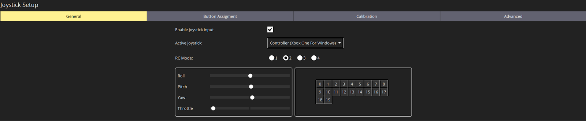
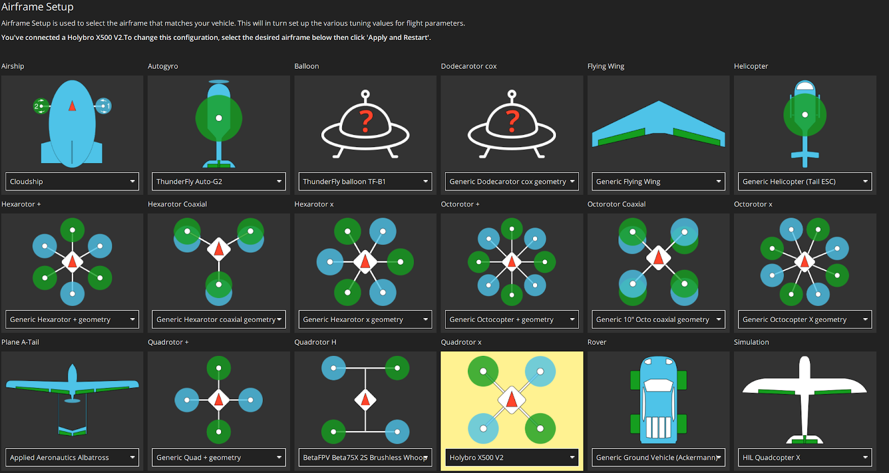
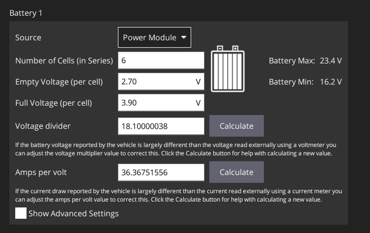
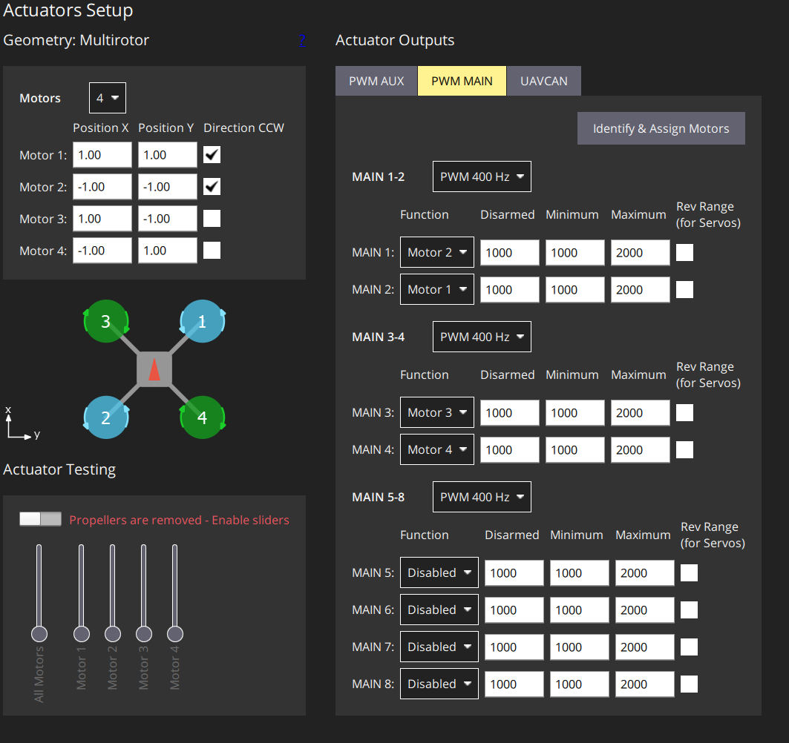

# Flight Guide \- Physical HW

# Components

## Hardware

* Xbox Series X Controller \+ USB-A to USB-A or USB-A to USB-C Cable  
* Holybro X500 V2 Series ARF Kit

## Software

* QGroundControl v4.4.3 (Windows 11 Host)  
* PX4 Autopilot Firmware v1.15  
* Sik Telemetry v3 Firmware

# QGroundControl Configuration

The following section explains how to set up the Holybro X500 V2 ARF Kit using QGroundControl and a wired Xbox Controller (Xbox Series X) for the joystick on Windows 11\.

First, connect the SiK Telemetry Radio v3 (using the provided USB-A or USB-C connectors) to your PC. Connect the Pixhawk 6C to the PC using the provided USB-A to USB-C cord. Connect the Xbox controller to the PC via USB. Start QGroundControl.

Then, see [Setup View | QGC Guide (master)](https://docs.qgroundcontrol.com/master/en/qgc-user-guide/setup_view/setup_view.html) for an explanation for each of the settings. 

## Joystick

See the section for settings changes related to Joystick calibration.

Under the **General** tab, ensure

1. **Enable joystick input** is checked  
2. The **Active joystick** is the Xbox controller  
3. The **RC Mode** is set to 2\. 

Under **Button Assignments**, one usable button needs to be mapped to the image capture function. Note that **5** and **15** (correspond to the LT and RT spring-loaded trigger buttons) are not usable. The image capture function is **Trigger camera**.

For flight:

* the RB button was selected for image capture  
* the A button was mapped to the arming action.

See the table below for a full mapping of QGC button numbers to buttons on the Xbox controller.

| Button on Xbox Controller | Button Number in QGC |
| ----- | :---- |
| A | 0 |
| B | 1 |
| X | 2 |
| Y | 3 |
| Double Overlapping Square | 4 |
| Three Lines | 6 |
| Left Joystick Click | 7 |
| Right Joystick Click | 8 |
| LB | 9 |
| RB | 10 |
| D-Pad Up | 11, 16 |
| D-Pad Down | 12, 17 |
| D-Pad Left | 13, 18 |
| D-Pad Right | 14, 19 |

NB: the PX4 Message `ManualControlSetpoint` only defines a single `uint16_t` field for buttons.

To calibrate the joysticks on the gamepad, go to the **Calibration** tab and click on **Start**. Follow the instructions.

Under the **Advanced** tab, make sure to select “Center stick is zero throttle”. This will map the neutral position of the Xbox left joystick (which controls throttle) to no throttle. This can prevent the drone from suddenly and rapidly taking off, as well as avoid critical warnings (and errors) related to high throttle.

## Airframe

Under Airframe, find the **Quadrotor x** airframe type and select **Holybro X500 V2** in the dropdown.  

## Sensors

Click through the different detected sensors on the vehicle to calibrate them. Follow the instructions for each calibration procedure. In total, there are 4 procedures for the kit:

1. Compass  
2. Gyroscope  
3. Accelerometer  
4. “Level Horizon”, which can be done during flight.

## Radio, Flight Modes

These sections can be skipped. See the [Parameters](#parameters) section for how to enable joystick only.

## Power

Set

* **Source** to Power Module  
* **Number of Cells** (in Series) to 6  
* **Empty Voltage (per cell)** to 2.70 V  
* **Full Voltage (per cell)** to 3.90 V

Using a DMM, measure the voltage and current draw across the battery terminals. First click the “Calculate” button, and then record the measurements in the text boxes for both the **Voltage divider** and **Amps per volt** fields.  

For real-time power data, connect the battery while performing these configurations. This will allow the voltage divider and amps per volt fields to be filled in properly.

Then, calibrate the **ESC**s. Ensure the propellers (“props”) are removed first, and that the battery must be plugged in. Leave the USB connection to the PC. The UAVCAN settings can be skipped.

## Actuators

First, click the **PWM Main** tab under **Actuator Outputs,** and then **Identify & Assign Motors**. Each motor will spin; select the one that spins when prompted. Note that the Red Arrow on the UI matches the direction of the arrow on the top of the drone frame (as well as the Pixhawk and the GPS) \- this is the “forward” orientation. Leave all other settings default.

Once the Actuator outputs have been identified, ensure the propellers are removed. Under **Actuator Testing**, enable the sliders by flipping the switch. Play around with the throttle sliders and ensure each motor can spin individually, as well as all at once. **Note that the battery needs to be plugged in to perform the actuator tests.**

## PID Tuning

See [Tuning (PX4) | QGC Guide (master)](https://docs.qgroundcontrol.com/master/en/qgc-user-guide/setup_view/tuning_px4.html) for more information. Note that tuning (auto-tuning in particular) should only be done once the drone can perform the stabilization and maneuvers detailed in the aforementioned link. Generally, it should only be done once.

The airframe selection already provides good enough base tuning. However, further calibration may be necessary, especially with the addition of a payload like the Raspberry Pi, the cameras, and any extra mounts.

Tuning is still important even with manual control to make responses to commands better.

## Safety and Flight Behaviour

Good safety and flight behaviour can prevent the drone from disarming itself.

## Camera

This section can be skipped (for now).

## Parameters {#parameters}

For any modifications to parameters that prompt you to “Reboot the Vehicle”, rebooting right after the vehicles recommended. Do this by clicking the “Tools” button on the top right, and then “Reboot Vehicle”.

### Parameters \- Joystick

* **COM\_RC\_IN\_MODE** should be set to 1, or **Joystick only**  
* **MAV\_0\_RATE** should be set to maximum baud rate for serial 8N1, or 5760 B/s

Note that setting COM\_RC\_IN\_MODE to Joystick only will disable the Radio section. This is because joysticks are not the same as RC transmitters, and so there is no need for Radio calibration (you do Joystick calibration instead).

## Flight

* Return to the QGroundControl landing / homepage. Ensure “Fly” is selected.  
* Click on the mode (it might say Position or Hold) and then select Manual.  
* Click on “Ready to Fly”. Press “A” to arm the drone.

Note that the drone will automatically disarm if low (near-zero) throttle is detected. On the field, this will not be an issue since sufficient throttle will be needed to get the drone off the ground.

# Development Notes

Presented below are somewhat coherent notes taken during the bring-up process, left here to potentially aid future debugging.

Power Setup

* 2.5 V low (set to 2.7 for tolerance) → Bumped up to 3.2  
* 3.7 full (22.2V 6s, so 3.70 V nominal) → Bumped up to 4.2

Battery measurements

* Voltage: 23.2 V  
* Amps: 11.5 A

For Sik Telemetry Radio, want

* Solid Green LED \== link has been established with another radio  
* Blinking RED \== data is being transmitted

See [LED and Connection | Holybro Docs](https://docs.holybro.com/radio/sik-telemetry-radio-v3/led-and-connection) for more information.
