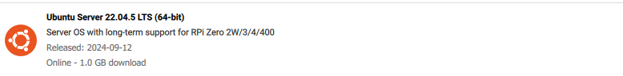
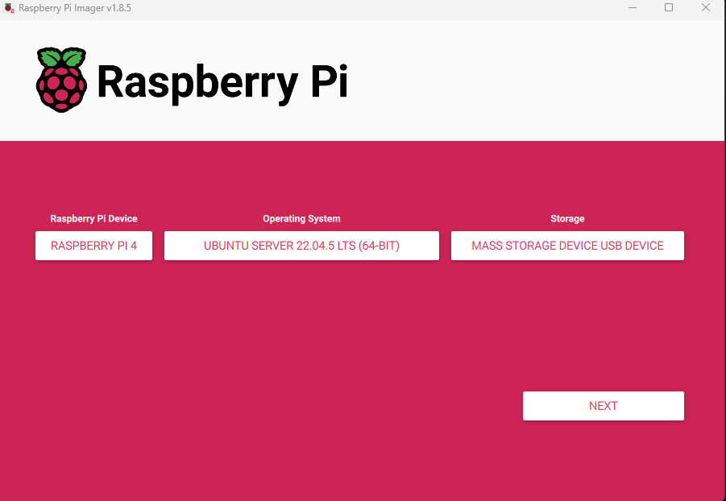
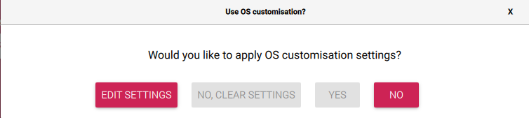
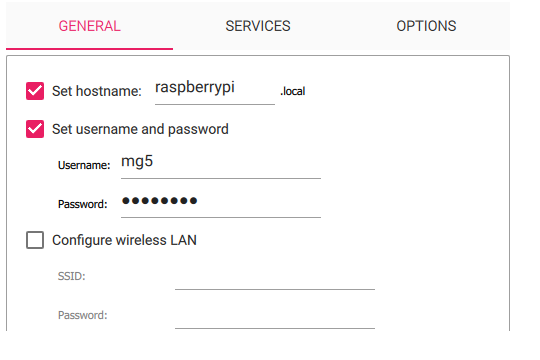
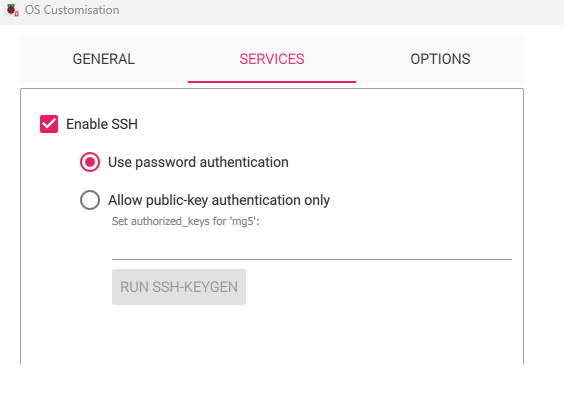
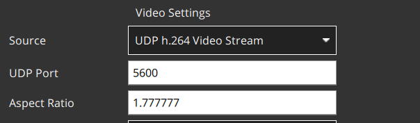

# SBC Provisioning Guide

TODO: Add section for field wlan configuration

## Formatting the SD Card and Mounting Ubuntu

On Windows:

1. This guide will use the [Raspberry Pi Imager](https://www.raspberrypi.com/documentation/computers/getting-started.html#raspberry-pi-imager). Download the [latest](https://downloads.raspberrypi.org/imager/imager_latest.exe) and run setup.  
2. You will need a USB microSD card reader (Type-A or Type-C). Insert the SD card into the card reader, and plug the card reader into your PC.  
3. Open up the Raspberry Pi Imager. For **Raspberry Pi Device**, choose **Raspberry Pi 4**. For Operating System, choose **Other general-purpose OS.** In the menu that follows, choose **Ubuntu Server 22.04.5 LTS (64-bit**).



4. Click **Choose Storage** and find the USB microSD card reader (will typically be a D: drive; check that the storage matches up with the storage of the SD card you inserted).




5. Hit **Next.**  
6. A dialog named “Use OS customisation” will appear. Click **Edit Settings.**



7. Under **General**, leave hostname as `raspberrypi`. Set username to \*\*\*\****mg5-ubuntu***\*\*\*\* (IMPORTANT\! The image says `mg5`, which is outdated) and set a password (ask @Henchel-Santillan for what the default is). You must configure wireless LAN (doing this later is possible, but why not do it now?). Locale settings are optional (you will see locale settings if you scroll down).



8. Under **Services**, check **Enable SSH**, and check **Use password authentication**. Hit **Save** on the dialog to save your changes. When you return to the “Use OS customisation” dialog, select **Yes** to apply your settings.  
9. Hit **Yes** again to reformat the SD card and mount Ubuntu. Write operation will take 5 to 10 minutes. Once finished, you may exit the imager and remove the mass storage device.

  

Once completed, you may proceed to the [Provisioning Guide](#provisioning-guide).

## Provisioning Guide

### Summary of System Information

Username: `mg5-ubuntu`  
Hostname: `raspberrypi`  
Password: **Default**  
IP Address: **Network-dependent**

SSH uses **password authentication**; when prompted, enter the Password used during setup.

### First Time Setup

First-time setup is best done with a monitor and keyboard. Opening an SSH session and provisioning on a remote machine also works nicely. Boot the system and wait until initialization is finished. The first time is always the longest. Once in, log in using the configured username and password and follow the steps below in the order given.

**Find the IP address of the Raspberry Pi**.  
`hostname -I`

Ensure your PC is on the same network (and interface) as the Raspberry Pi (e.g. if WLAN is configured, connect your PC to WiFi and not ethernet). Try to ping the Raspberry Pi on your PC.

`ping <RPI_IP_ADDR>`

You can SSH into the device from your PC using the username and hostname:  
`ssh mg5-ubuntu@raspberrypi`

Alternatively, you can supply the IP address:

`ssh mg5-ubuntu@<RPI_IP_ADDR>`

If using Windows, it is strongly recommended to create a `config` file in the `.ssh` directory in your user root for SSH to define a keep-alive interval *n*. Configuring this will mean a keep-alive packet is sent every *n* seconds, preventing random (and untimely) client disconnects. On Windows, the OpenSSH client may have trouble locating the `config` file. You may need to pass the absolute path to the ssh command with the `-F` option. The full command now becomes (with verbosity):

`ssh -v mg5-ubuntu@<RPI_IP_ADDR> -F C:\Users\user\.ssh\config`

The next step is to upgrade and then install essential tools. First, run

`sudo apt update && sudo apt upgrade -y`  
`reboot`

Once the system finishes reboot, install the following:

`sudo apt update && sudo apt install -y net-tools procinfo`

Find the MAC address of the Raspberry Pi using `ifconfig -a`, and add it to the list of supported devices on your network settings page (only if necessary, otherwise simply authenticate on connection attempt). In our case, the Raspberry Pi connects to WiFi; look for the MAC next to the `IPv4` field under  `wlan0` (or similar).

### Installing Dependencies Using the Provisioning Script 

The provisioning script is an all-in-one shell script that installs and builds the major dependencies (libcamera, ROS2, PX4 agent), located [here](https://github.com/Henchel-Santillan/mg5/blob/main/scripts/provision.sh). It is the recommended (and most convenient) way to install the dependencies on a new system.

You may either proceed with Method 1 or Method 2\. If you choose Method 2, see the section on [Setting Up SSH Keys](#setting-up-ssh-keys) on the SBC

#### Method 1 \- SSH from a Remote Machine

`cd mg5`  
`scp -r scripts mg5-ubuntu@<RPI_IP_ADDR>:~`  
`ssh mg5-ubuntu@<RPI_IP_ADDR>`  
`chmod +x scripts/provision.sh && ./scripts/provision.sh`

It is recommended to reboot the system after installation.  
`sudo reboot`

#### Method 2 \- Cloning mg5 directly on the SBC

#### Setting Up SSH Keys {#setting-up-ssh-keys}

The first step involves setting up SSH keys for development.

`ssh-keygen -t ed25519 -C "your_email@example.com"`

You may choose to rename the key and enter a passphrase if desired. Follow [Adding a new SSH key to your GitHub account \- GitHub Docs](https://docs.github.com/en/authentication/connecting-to-github-with-ssh/adding-a-new-ssh-key-to-your-github-account) to add the new SSH key to your GitHub account. To clone anything mg5-related, **you must first be a collaborator** and have correctly configured permissions for the repositories of interest.

If you need to know the default passphrase / password on an already provisioned `mg5-ubuntu` headless system, ask @Henchel-Santillan.

#### Run the Script

Now, simply run the script as in Method 1\.  
`chmod +x scripts && ./scripts/provision.sh`  
`sudo reboot`

Once finished, follow the section on [Configuring /boot/firwmare/config.txt](#configuring-/boot/firwmare/config.txt).

## Configuring `/boot/firwmare/config.txt`

Use the `raspi-config` utility to ensure support for the Legacy Camera Hardware is **disabled**. You can do this by first running `raspi-config` in the terminal, navigating to `Interface Options`, hitting **Enter** on the **Legacy Hardware** option, and selecting “No”.

`/boot/firmware/config.txt` also needs to be configured to use the Raspberry Pi HQ M12 camera. To do this:

`sudo nano /boot/firmware/config.txt`

and:

1. Disable automatic camera detection

`camera_auto_detect=0`

2. Add the required overlay for the image sensor (`IMX477` in this case)

`dtoverlay=imx477`

Reboot for the changes to be applied: `sudo reboot`

To see if the HQ camera was correctly setup, you can test using  
`rpicam-hello --list-cameras`

If you see the message `No cameras available!`, recheck the connection to the CSI port. Ensure that the cable is facing away from the RJ45 ethernet port, and that the black connector is fully down. The cable should be snug.

**Note:** if the above changes do not work, you may copy the [config.txt](https://github.com/Henchel-Santillan/mg5/blob/main/config.txt) file from the root of the `mg5` repository to `/boot/firmware/config.txt` and reboot.

Otherwise, if you get an output with `IMX477` in it, this means you set everything up correctly. TODO: Add example output

## Creating the ROS2 Workspace

The ROS2 workspace contains ROS2 packages. The necessary ROS2 dependencies should have been installed through the provisioning script. Create the workspace as follows:

`mkdir -p ~/ros2ws/src`

### Fetching the Required Packages

1. [mg5x](https://github.com/Henchel-Santillan/mg5x) (package with a ROS2 node that subscribes to PX4 VehicleCommands and captures images when requested)  
2. [px4\_msgs](https://github.com/PX4/px4_msgs) (contains PX4 message definitions for ROS2)

Note that cloning these packages requires [Setting Up SSH Keys](#setting-up-ssh-keys). If you followed this as part of executing the provisioning script, proceed. Otherwise, set up the SSH keys first.

Once ready, add the key to the SSH agent and clone the required packages into `~/ros2ws/src`.

`eval "$(ssh-agent -s)"`  
`ssh-add ~/.ssh/<your SSH key name>`  
`git clone git@github.com:Henchel-Santillan/mg5x.git ~/ros2ws/src/mg5x --recursive`  
`git clone git@github.com:PX4/px4_msgs.git ~/ros2ws/src/mg5x`

### Building the Packages

Use `colcon` to build the ROS2 packages in the workspace. In `~/ros2ws/src`:

`colcon build`

This will build all the packages (px4\_msgs first, then mg5x, since mg5x depends on px4\_msgs). You must build all the packages (at least the first time). After, you may choose which package to build:

`colcon build --packages-select <packages to build>`

## Setting Up the Live Feed Camera

The live feed camera is the Arducam 8MP USB Camera Module (see [Arducam 8MP 1080P USB Camera Module, 1/4” CMOS IMX219 Mini UVC USB2.0 Webcam Board with 1.64ft/0.5m USB Cable for Windows, Linux, Android and Mac OS \- Arducam](https://www.arducam.com/product/b0196arducam-8mp-1080p-usb-camera-module-1-4-cmos-imx219-mini-uvc-usb2-0-webcam-board-with-1-64ft-0-5m-usb-cable-for-windows-linux-android-and-mac-os/)). It is based on the IMX219 sensor. It is also a UVC-compliant camera, and so is not (currently, or maybe forever?) incompatible with `libcamera`.

Plug the USB camera in. Make sure you plug it into the USB 3.0 ports (the blue ones) as they provide more current draw.  
Running `lsusb`, you should see something like the following:

```
Bus 001 Device 004: ID 0c45:6366 Microdia Webcam Vitade AF
```

`v4l2-ctl --list-devices` should have `Arducam_8mp` in the output:

```
Arducam\_8mp: USB Camera (usb-0000:01:00.0-1.3):  
	/dev/video0  
	/dev/video1  
	/dev/media2
```

If you haven’t already, clone the `mg5` repository into `~`. Build the `mg5-stream-app` by following the instructions [here](https://github.com/Henchel-Santillan/mg5/blob/main/stream/README.md). 

To build with YUYV used as the raw format (default, and tested):

`./build.sh YUYV`

To build with MJPG used as the raw format,

`./build.sh MJPG`

Note that QGroundControl **does not** support direct MJPG video streams (they must first be converted to H.264). Use [VLC Media Player](https://www.videolan.org/vlc/download-windows.html) instead. TODO: Create a section for VLC Media Player MJPG Streaming.

Regardless, the `mg5-stream-app` executable will be used when setting up the live feed service in the next section.

**Tip:**  
In QGroundControl, click on the “Q” icon \> Application Settings. This is what you should configure based on what stream. Captured below are the default settings, which should work right out of the box with the default stream settings (the "YUYV" build).



To record a video, press the red record button on the homepage. Videos are saved by default, on Windows, at `%USERPROFILE%\Documents\QGroundControl\Videos`.

## Adding System-Wide Services

To start the PX4 uXRCE-DDS Agent, the ROS2 `image_capture_node` from the `mg5x` package, and the live feed, three `systemd` services need to be enabled and started:

* `mg5-stream.service`  
* `mg5x.service`  
* `uxrce-dds.service`

Follow the instructions [here](https://github.com/Henchel-Santillan/mg5/blob/main/services/README.md) for provisioning the services. Once finished, the SBC should be fully provisioned for use.

# Extracting Files from the SBC

There are 2 main ways to extract files from the SBC:

**Method 1: scp over SSH**  
You need to be able to ping your Raspberry Pi for this first method. This is the fastest method for file transfer, and only requires a connection to the SBC (if you're lucky enough).

There may be several reasons why you cannot ping the SBC - nobody knows why! Just wait a bit for some good fortune.

Example (copying a directory):

`scp -r mg5-ubuntu@<RPI_IP_ADDR>:<path/to/folder> <destination on host>`  

To copy a file, omit the recursive option (`-r`).

**Method 2: Use a Physical USB Drive**  
Connect a USB drive to any of the USB ports, USB 3.0 preferred (blue ports).

1. Identify the USB device using `lsblk`.  
2. Once identified, create a mount point. An example is given below:

`sudo mkdir /media/usb`

3. Mount: `sudo mount /dev/sdb1 /media/usb`, where `/dev/sdb1` is an example of an identified USB device from Step 1\.  
4. Move or copy files using `mv` or `cp`  
5. Unmount the device: `sudo umount /media/usb`.  
6. Unplug the USB device, plug into your PC, and retrieve the files.
