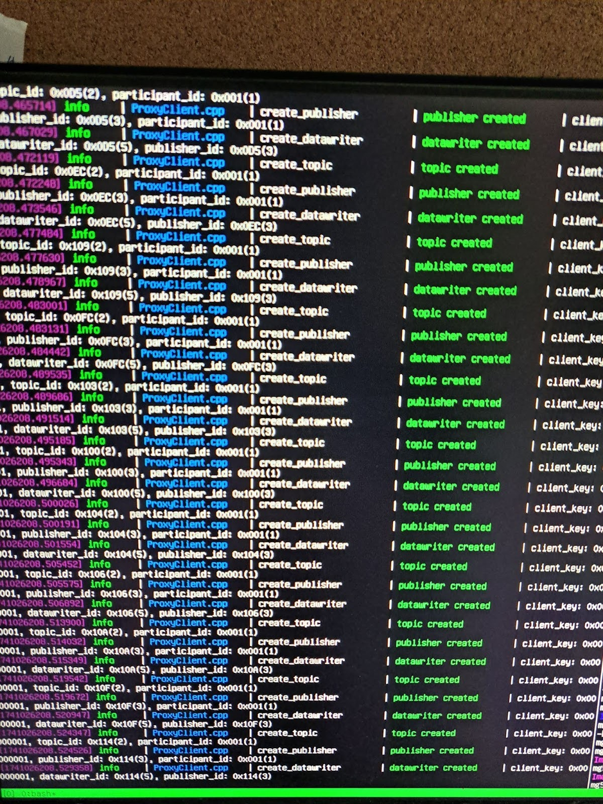

# Flight Guide \- Simulation (PX4 SITL)

This flight guide uses Gazebo and the PX4 Software-in-the-Loop (SITL). Note: the following sections describe how to run QGroundControl (QGC) on a Windows 11 Host, the PX4 Simulator on an Ubuntu VM, and the uXRCE agent on a Raspberry Pi 4B. See [ROS 2 User Guide | PX4 Guide (main)](https://docs.px4.io/main/en/ros2/user_guide.html) for more details.

# Set Up Bridged Network (VMWare Workstation)

The steps presented below were tested with VMWare Workstation Pro 17.5.

## Starting Fresh

In VMWare, click on `Edit > Virtual Network Editor > Change Settings`. On the bottom, click “Restore Defaults”. Once finished, click through `VM > Settings > Network Adapter`. Make sure Bridged and “Replicate physical network connection state” are selected.

You may also refer to this [video](https://www.youtube.com/watch?v=kQSB5bBD7wU&t=78s) for instructions.

## Configuring a Static IP for the VM using netplan

To do so, open cmd on Windows host and `ipconfig /all`. Then, look for `Wireless LAN adapter Wi-FI`, and find the default gateway and the subnet mask. For IP address, choose anything in the subnet (although some might be taken or reserved – experiment with this).

Edit the YAML file under `/etc/netplan` to include the following configuration:

\`\`\`  
network:  
  version: 2  
  renderer: networkd  
  ethernets:  
    ens33:  \# Replace 'ens33' with your actual network interface name  
      dhcp4: no  
      addresses:  
        \- \<IP\_ADDRESS\>/\<NETMASK\>   
      gateway4: \<GATEWAY\>  
      nameservers:  
        addresses:  
          \- 8.8.8.8  
          \- 1.1.1.1  
\`\`\`

where

* `<IP_ADDRESS>` is the target IP address  
* `<NETMASK>` is a decimal number representing the original 4-octet (32-bit) subnet mask (e.g. `/28` means the first 28 bits are set, and the remaining 4 are 0, giving a subnet mask of 255.255.255.240)  
* `<GATEWAY>` is the IP address of the router serving as an AP for traffic to leave the local network.

The above values should be changed.

Then:

\`\`\`  
sudo netplan apply  
\`\`\`

If necessary, also make sure MAC address is also added to your institution’s network settings page (in order to connect to wlan).

At this point, the VM should be able to ping the router (via the default gateway). If the VM cannot ping the host, follow the Firewall Rules section below.

## Creating Windows Firewall Rules for UDP and ICMPv4

In order to ping the VM from the host machine (and vice versa), inbound and outbound Windows Firewall rules need to be created. Create inbound rules for ICMPv4 and UDP, and an outbound rule for UDP only. 

Click through `Windows Defender Firewall > Advanced Settings > Inbound/Outbound Rules > New Rule`.

**UDP Rules (Inbound and Outbound)**  
Either `New Inbound Rule Wizard` or `New Outbound Rule Wizard` will open.

* For Rule Type, select `Port`.  
* For Protocols and Ports, select `UDP` and specify a specific local port `14550` (which is the default UDP port that the PX4 simulator uses to connect to a running GCS, such as QGC).  
* For Action, `Allow the connection`.  
* For Profile, select all of `Domain`, `Private`, and `Public`.  
* Give the rules a name and description.

**ICMPv4 (only inbound)**

* Select `Custom` for Rule Type.  
* For Protocol and Ports, select `ICMPv4`.

Leave all other settings default (ensure `Public` is also checked under Scope). At this point, the VM should be able to ping both the router and host.

# Simulation \- QGroundControl

On the Windows Host, connect the Xbox controller. Make sure to press the power button in the middle. Launch QGC.

# Simulation \- Client

## Editing Simulator Startup Files

Modify `~/PX4-Autopilot/ROMF/px4fmu_common/init.d-posix/px4-rc.mavlink`.  
On the line that says `mavlink start -x -u $udp_gcs_port_local -r 4000000 -f` under the comment `# GCS link`, add the following option:

\`\`\`  
\-t \<WINDOWS HOST IP\>  
\`\`\`

This allows QGC running on the host to connect to the PX4 Simulator. In  `~/PX4-Autopilot/ROMF/px4fmu_common/init.d-posix/rcS,l`ook for the line that runs the `uxrce-dds-client`.

Change 127.0.0.1 (localhost) to the IP address of the Raspberry Pi. On the VM, start the PX4 MicroXRCE-DDS Client. This is automatically done when the simulator is run:

`cd PX4-Autopilot`  
`make px4_sitl gz_x500`

In the startup messages, you should see something as follows:

\`\`\`  
INFO  \[uxrce\_dds\_client\] init UDP agent IP:\<RASPBERRY\_PI\_HOST\>, port:8888  
INFO  \[mavlink\] mode: Normal, data rate: 4000000 B/s on udp port 18570 remote port 14550  
INFO  \[mavlink\] mode: Onboard, data rate: 4000000 B/s on udp port 14580 remote port 14540  
INFO  \[mavlink\] mode: Onboard, data rate: 4000 B/s on udp port 14280 remote port 14030  
INFO  \[mavlink\] mode: Gimbal, data rate: 400000 B/s on udp port 13030 remote port 13280  
INFO  \[logger\] logger started (mode=all)  
INFO  \[logger\] Start file log (type: full)  
INFO  \[logger\] \[logger\] ./log/2025-03-03/17\_29\_14.ulg	  
INFO  \[logger\] Opened full log file: ./log/2025-03-03/17\_29\_14.ulg  
INFO  \[mavlink\] MAVLink only on localhost (set param MAV\_{i}\_BROADCAST \= 1 to enable network)  
INFO  \[mavlink\] MAVLink only on localhost (set param MAV\_{i}\_BROADCAST \= 1 to enable network)  
INFO  \[px4\] Startup script returned successfully  
pxh\> INFO  \[tone\_alarm\] home set  
INFO  \[commander\] Ready for takeoff\!  
\`\`\`

The `INFO [commander] Ready for takeoff!` message means that the PX4 simulated vehicle was able to establish a connection to the GCS (QGroundControl running on host). The `INFO  [uxrce_dds_client] init UDP agent IP:<RASPBERRY_PI_HOST>, port:8888` means that the client will try to forward messages over UDP to the target IP over the given port (note that this was localhost before).

QGC should now say “Ready for Flight”. The Joystick option (among others) should now appear under the Vehicle Setup section. Configure the joystick as in [here](https://docs.qgroundcontrol.com/master/en/qgc-user-guide/setup_view/joystick.html).

# Simulation \- Agent (On the Raspberry Pi)

Use `tmux` and split the window (example below does so horizontally).

\`\`\`  
tmux  
tmux split-window \-h  
\`\`\`  
In one terminal start the agent with settings to connect to the client running on the simulator:

\`\`\`  
MicroXRCEAgent udp4 \-p 8888  
\`\`\`

Start the ROS2 `image_capture_node` from the `mg5x-main` target, built as part of the `mg5x` package.

\`\`\`  
cd \~/ros2ws/src  
colcon build \--packages-select mg5x \--cmake-args \-DTESTING=OFF  
source install/setup.bash  
ros2 run mg5x mg5x-main  
\`\`\`

On the Raspberry Pi, you should start to see messages about topics, publishers, and datawriters being created. See image below for reference:

# Simulating

If you press the RB button, you should see rpicam-still logs from the ROS2 node terminal. If you return to `~/images`, you should see a directory with today’s date, a nested directory prefixed with `Images_` and the hours, month, and day, and `Image0`.

Restart the running `mg5x.service` via `sudo systemctl restart mg5x`. This should also work with the service enabled.

# Troubleshooting

* Make sure to Press the middle of Xbox controller (the icon) to turn on the controller so that it can be detected by QGC. Otherwise, the option to use joystick will not appear. By default, PX4\_SITL builds are automatically configured to use joystick (`COM_RC_IN_MODE` is set to `Joystick only` in the Parameters section).  
* May need to build mg5x ROS2 node using `colcon build --packages-select mg5x --cmake-args -DTESTING=OFF` for it to select the correct build target … may require a CMake fix.  
* Run `ros2 topic list` in the ROS2 workspace. If you see `/fmu/out/manual_control_setpoint` (among other /fmu topics), then the agent is running correctly, and is properly connected to the PX4 SITL running in the VM.  
* Run `ros2 topic echo /fmu/out/manual_control_setpoint`. If you press buttons and the “Buttons” log changes, then this means that messages are being published correctly, and there may be an issue with the ROS2 node.

# Notes

List of topics used on the uXRCE-DDS client:  
[PX4-Autopilot/src/modules/uxrce\_dds\_client/dds\_topics.yaml at main · PX4/PX4-Autopilot](https://github.com/PX4/PX4-Autopilot/blob/main/src/modules/uxrce_dds_client/dds_topics.yaml)

Time sync between ROS2 and PX4 is automatically managed by the uXRCE-DDS middleware. Only one uXRCE-DDS agent is permitted per connection channel.

Can get joystick input by inspecting the /fmu/out/manual\_control\_setpoint topic.  
[SITL Gazebo RC/joystick inputs via ROS? \- ROS 1 / ROS 2 \- Discussion Forum for PX4, Pixhawk, QGroundControl, MAVSDK, MAVLink](https://discuss.px4.io/t/sitl-gazebo-rc-joystick-inputs-via-ros/13140/12)

[How to connect Host QGC & VMWare's STIL's UDP link \- Discussion Forum for PX4, Pixhawk, QGroundControl, MAVSDK, MAVLink](https://discuss.px4.io/t/how-to-connect-host-qgc-vmwares-stils-udp-link/18367)
